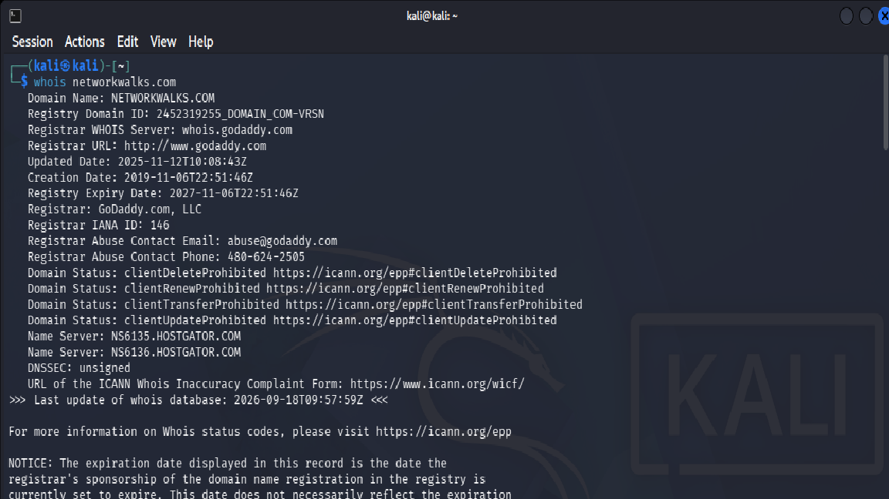
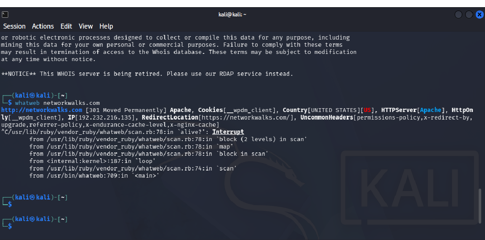
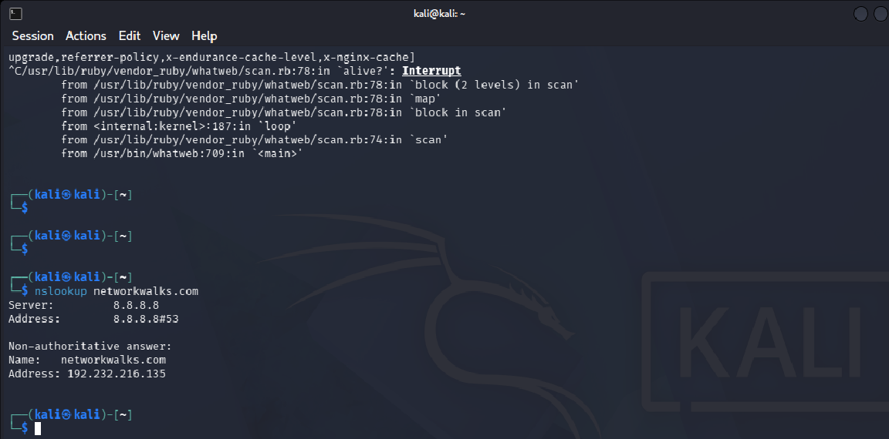
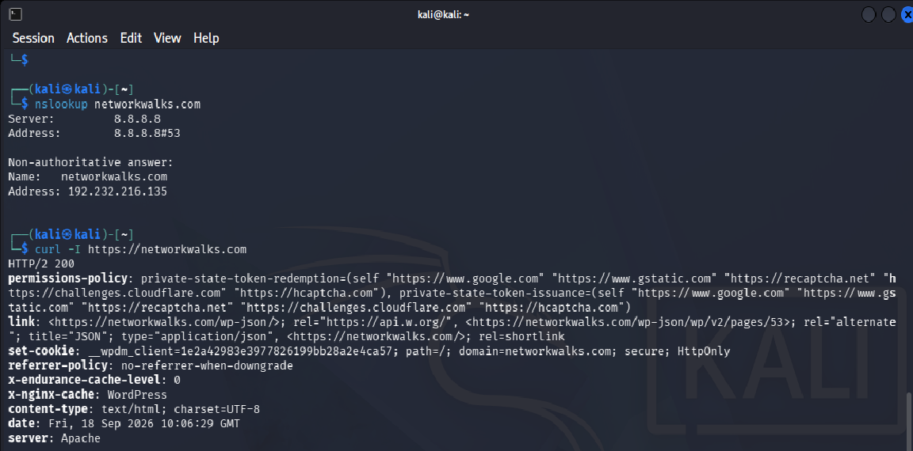

# NETWORKWALKS-WK2-FOOTPRINTING-NETWORK-SCANNING-PHASES

# PENETRATION TESTING REPORT

## FOOTPRINTING, RECONNAISSANCE & NETWORK SCANNING PHASES

**W2-PM-FINAL | CYBERSECURITY | NETWORKWALKS**

| **Details**                         | **Information**                                                                                       |
| ----------------------------------- | ----------------------------------------------------------------------------------------------------- |
| **Pentester Name**                  | **[YOUR NAME]**                                                                                       |
| **Program/Batch**                   | **B082-Networkwalks**                                                                                 |
| **Date**                            | **18 September 2026**                                                                                 |
| **Modules Completed**               | **W2-PM1 – Multiple Kali Tools**<br>**W2-PM3 – Maltego Footprinting**<br>**W2-PM5 – Zenmap Scanning** |
| **Client/Target**                   | **Networkwalks (`networkwalks.com`) – authorized internship target**<br>**My own local LAN network**  |
| **Permission secured from client?** | **Yes – as provided for the authorized internship practical**                                         |
| **Phases Covered**                  | **Phase 1:** Reconnaissance & Footprinting<br>**Phase 2:** Scanning & Network Discovery               |

---

# 1. Liability Disclaimer

I performed these activities only within the authorized scope provided for the internship practical and on systems or networks that I was permitted to test. The activities were conducted for educational and cybersecurity learning purposes.

The reconnaissance and scanning techniques demonstrated in this report should only be used against systems for which appropriate authorization has been obtained. Unauthorized scanning, enumeration, or access attempts may violate organizational policies and applicable laws.

No exploitation or unauthorized access was performed as part of these practical exercises.

---

# 2. Introduction

This report documents the practical cybersecurity activities completed during **Week 2 of the Networkwalks Cybersecurity & Ethical Hacking Internship**.

The week covered three major practical modules:

* **W2-PM1 – Footprinting & Reconnaissance Attacks with Multiple Kali Tools**
* **W2-PM3 – Footprinting with Maltego**
* **W2-PM5 – Network Scanning with Zenmap**

The first module focused on gathering publicly available information about the authorized target domain using several Kali Linux reconnaissance tools. The second module used Maltego to investigate information related to the authorized organization domain. The third module focused on discovering active hosts within my own local network using Zenmap.

These exercises demonstrate the difference between **passive information gathering, technical reconnaissance, and network discovery**.

All activities were performed for educational purposes and within the permitted scope.

---

# 3. Objectives

The main objectives of the Week 2 practical activities were:

1. Understand the concept of reconnaissance and footprinting.
2. Learn how to collect publicly available information about a domain.
3. Understand domain registration and DNS information.
4. Identify technologies used by a web application.
5. Examine HTTP response headers.
6. Identify whether a Web Application Firewall is present.
7. Learn DNS enumeration techniques.
8. Use Maltego to visualize and investigate relationships between information.
9. Install and use Zenmap for network discovery.
10. Identify live hosts in a local network.
11. Identify IP and MAC addresses of discovered hosts.
12. Generate and save a network topology.
13. Understand the importance of authorization during security testing.

---

# 4. Tools and Technologies Used

| **Tool**        | **Purpose**                                                       |
| --------------- | ----------------------------------------------------------------- |
| **Kali Linux**  | Operating system used for cybersecurity reconnaissance activities |
| **WHOIS**       | Obtains publicly available domain registration information        |
| **WhatWeb**     | Identifies web technologies and application fingerprints          |
| **Nslookup**    | Resolves domain names and obtains DNS information                 |
| **curl**        | Examines HTTP response headers                                    |
| **Wafw00f**     | Detects Web Application Firewalls                                 |
| **DNSRecon**    | Performs DNS enumeration                                          |
| **Maltego**     | Performs visual link analysis and footprinting                    |
| **Windows**     | Operating system used for Zenmap activities                       |
| **Zenmap**      | Graphical interface for Nmap-based network scanning               |
| **Windows CMD** | Used to identify local IP configuration and network information   |

---

# 5. W2-PM1 – Footprinting & Reconnaissance with Multiple Kali Tools

## 5.1 Task 1 – WHOIS

### Objective

To obtain publicly available domain registration information for the authorized target domain.

### Tool Used

**WHOIS**

### Command Used

```bash
whois networkwalks.com
```

### Procedure

I opened the Kali Linux terminal and executed the WHOIS command against the authorized domain. WHOIS was used to retrieve publicly available information associated with the domain registration.

### Observation

The command returned publicly available domain-related information such as registration details, domain status information, and name-server information, depending on the information exposed by the registrar.

### Security Relevance

WHOIS information can help a security professional understand the publicly visible registration and infrastructure information associated with a domain. Such information can contribute to the initial reconnaissance phase of an authorized security assessment.

### Evidence




# 5.2 Task 2 – WhatWeb

### Objective

To identify the technologies and web components used by the target website.

### Tool Used

**WhatWeb**

### Command Used

```bash
whatweb networkwalks.com
```

### Procedure

I used WhatWeb from Kali Linux to fingerprint the authorized website. The tool analyzed the website's responses and identified technologies that could be detected from the public-facing web application.

### Observation

The output provided information about technologies detected on the website.

**Actual result from my lab:**


### Security Relevance

Technology fingerprinting can help security professionals understand the technology stack of a web application during an authorized assessment. This information can then be used to determine which components require further security review.

### Evidence



---

# 5.3 Task 3 – Nslookup

### Objective

To resolve the target domain name to its corresponding IP address.

### Tool Used

**Nslookup**

### Command Used

```bash
nslookup networkwalks.com
```

### Procedure

I used Nslookup to query the DNS system for the authorized domain.

### Observation

The command returned DNS resolution information for the domain.

**Resolved IP address observed in my lab:**

**[INSERT YOUR IP ADDRESS]**

### Security Relevance

DNS resolution provides information about the infrastructure associated with a domain. During authorized reconnaissance, this information can help establish the network location of publicly accessible services.

### Evidence



---

# 5.4 Task 4 – curl -I

### Objective

To inspect the HTTP response headers returned by the target website.

### Tool Used

**curl**

### Command Used

```bash
curl -I https://networkwalks.com
```

### Procedure

I used the `-I` option with curl to request the HTTP headers without retrieving the complete webpage content.

### Observation

The response displayed HTTP headers returned by the web server.

**Important headers/information observed:**

**[INSERT YOUR ACTUAL HEADERS OR IMPORTANT OBSERVATIONS]**

### Security Relevance

HTTP response headers can provide useful technical information about a web application and its configuration. Security professionals can review these headers to identify unnecessary information disclosure and security-related configuration issues.

### Evidence



---

# 5.5 Task 5 – Wafw00f

### Objective

To determine whether the target website uses a Web Application Firewall.

### Tool Used

**Wafw00f**

### Command Used

```bash
wafw00f https://networkwalks.com
```

### Procedure

I used Wafw00f to analyze the target website and determine whether a Web Application Firewall could be identified.

### Observation

Wafw00f provided information about the detected WAF, if one was identifiable.

**Actual result from my lab:**

**[INSERT YOUR WAF RESULT]**

### Security Relevance

Identifying a WAF can help security professionals understand part of the defensive architecture protecting a web application. However, detection of a WAF does not confirm that the application is secure or insecure.

### Evidence

**[INSERT SCREENSHOT – WAFW00F RESULT]**

---

# 5.6 Task 6 – DNSRecon

### Objective

To enumerate publicly available DNS information associated with the authorized domain.

### Tool Used

**DNSRecon**

### Command Used

```bash
dnsrecon -d networkwalks.com
```

### Procedure

I used DNSRecon to perform DNS enumeration against the authorized domain.

### Observation

The tool returned DNS-related information such as available records and infrastructure information.

**Important results observed:**

**[INSERT YOUR DNSRECON RESULTS]**

### Security Relevance

DNS information can help security professionals understand an organization's publicly visible infrastructure. During an authorized assessment, this information may be used to identify services that require security review.

### Evidence

**[INSERT SCREENSHOT – DNSRECON RESULT]**

---

# 6. W2-PM3 – Footprinting with Maltego

## 6.1 Task 1 – Install Maltego

### Objective

To download and install Maltego on a Windows computer.

### Procedure

I downloaded and installed Maltego on my Windows computer and successfully launched the application.

### Observation

Maltego was successfully installed and opened on the system.

### Evidence

**[INSERT SCREENSHOT – MALTEGO INSTALLED / APPLICATION WINDOW]**

---

# 6.2 Task 2 – Find Email Addresses Related to networkwalks.com

### Objective

To identify publicly discoverable email addresses associated with the authorized organization domain `networkwalks.com`.

### Tool Used

**Maltego**

### Procedure

I created an investigation in Maltego for the authorized domain and used the available transforms to identify publicly associated information, including email-address entities.

### Observation

Maltego returned email-related entities associated with the target domain.

**Number of email addresses identified:**

**[INSERT NUMBER]**

**Email addresses identified:**

**[INSERT YOUR ACTUAL MALTEGO RESULTS]**

### Security Relevance

Publicly available email addresses can provide information about an organization's communication structure. From a defensive perspective, organizations should understand what contact information is publicly exposed and monitor for potential misuse such as phishing or social engineering.

The discovery of an email address does **not** indicate that the account is compromised or vulnerable.

### Evidence

**[INSERT SCREENSHOT – MALTEGO EMAIL RESULTS]**

---

# 7. W2-PM5 – Network Scanning with Zenmap

## 7.1 Task 1 – Download and Install Zenmap

### Objective

To install Zenmap on a Windows computer for network discovery.

### Procedure

I downloaded and installed Zenmap on my Windows computer and successfully launched the application.

### Evidence

**[INSERT SCREENSHOT – ZENMAP APPLICATION]**

---

# 7.2 Task 2 – Find Local IP Address and LAN Subnet

### Objective

To identify the local computer's IP address and determine the LAN subnet.

### Command Used

```cmd
ipconfig
```

### Procedure

I opened Windows Command Prompt and executed the `ipconfig` command. I examined the active network adapter to identify the IPv4 address and subnet information.

### Observation

**Local IPv4 address:**

**[INSERT YOUR IP ADDRESS]**

**Subnet information:**

**[INSERT YOUR SUBNET]**

### Evidence

**[INSERT SCREENSHOT – IPCONFIG RESULT]**

---

# 7.3 Task 3 – Find Live Hosts in the IP Subnet

### Objective

To identify active hosts within my own local network.

### Procedure

I entered my local subnet into Zenmap and selected the appropriate **Ping Scan** option to discover active hosts.

### Observation

Zenmap identified multiple responding hosts within the local subnet.

### Evidence

**[INSERT SCREENSHOT – ZENMAP PING SCAN RESULT]**

---

# 7.4 Task 4 – Number of Live Hosts

### Objective

To determine how many hosts were active in the local subnet.

### Observation

**Total number of live hosts discovered: [INSERT NUMBER]**

### Evidence

**[INSERT SCREENSHOT SHOWING LIVE HOSTS]**

---

# 7.5 Task 5 – IP Addresses of Live Hosts

### Objective

To record the IP addresses of the active hosts discovered during the scan.

### Results

| **No.** | **Live Host IP Address** |
| ------: | ------------------------ |
|       1 | [INSERT IP]              |
|       2 | [INSERT IP]              |
|       3 | [INSERT IP]              |
|       4 | [INSERT IP]              |
|       5 | [INSERT IP]              |
|     ... | [ADD AS REQUIRED]        |

### Security Relevance

Identifying active hosts provides an overview of devices currently responding on the local network. This information can help a network administrator maintain an accurate inventory and identify unexpected devices.

### Evidence

**[INSERT SCREENSHOT – ZENMAP HOST LIST]**

---

# 7.6 Task 6 – MAC Addresses of Live Hosts

### Objective

To identify the MAC addresses associated with discovered hosts where the information was available.

### Results

| **No.** | **IP Address** | **MAC Address** |
| ------: | -------------- | --------------- |
|       1 | [INSERT IP]    | [INSERT MAC]    |
|       2 | [INSERT IP]    | [INSERT MAC]    |
|       3 | [INSERT IP]    | [INSERT MAC]    |
|       4 | [INSERT IP]    | [INSERT MAC]    |
|       5 | [INSERT IP]    | [INSERT MAC]    |

### Security Relevance

MAC addresses provide information about network interfaces and can help administrators identify and track devices on a local network. The availability of MAC information depends on the network configuration and scanning conditions.

### Evidence

**[INSERT SCREENSHOT – MAC ADDRESS RESULTS]**

---

# 7.7 Task 7 – Display and Save Network Topology

### Objective

To visualize the discovered network and save the topology in PDF format.

### Procedure

After completing the network scan, I opened the **Topology** section in Zenmap. I reviewed the discovered network relationships and generated the network topology.

I then saved the topology output in **PDF format** on my Windows desktop as required by the practical.

### Observation

The topology displayed the discovered network hosts and their relationships based on the scan results.

### Evidence

**[INSERT SCREENSHOT – ZENMAP TOPOLOGY]**

**Saved topology file:**

`[INSERT YOUR PDF FILE NAME]`

---

# 8. Risk Analysis and Security Observations

The practical activities produced several observations that are relevant from a defensive cybersecurity perspective.

| **No.** | **Finding / Observation**                            | **Source** | **Potential Security Relevance**                                              | **Risk Level** |
| ------: | ---------------------------------------------------- | ---------- | ----------------------------------------------------------------------------- | -------------- |
|       1 | Public domain registration information is available  | WHOIS      | May contribute to an organization's public footprint                          | Low            |
|       2 | Web technologies can be fingerprinted                | WhatWeb    | Technology information may assist further authorized security assessment      | Medium         |
|       3 | Domain resolves to a publicly accessible IP address  | Nslookup   | Provides information about the location of the public-facing service          | Low            |
|       4 | HTTP response headers are publicly observable        | curl       | May disclose technical information depending on configuration                 | Low            |
|       5 | WAF information can potentially be identified        | Wafw00f    | Provides information about defensive infrastructure                           | Low            |
|       6 | DNS records are publicly discoverable                | DNSRecon   | Can help build a picture of public-facing infrastructure                      | Medium         |
|       7 | Publicly associated email addresses were identified  | Maltego    | Public contact information may be targeted for phishing or social engineering | Medium         |
|       8 | Multiple live hosts were discovered on the local LAN | Zenmap     | Helps administrators identify and inventory network devices                   | Medium         |

**Important:** These are **security observations, not confirmed vulnerabilities**.

The ability to discover a domain's IP address, DNS records, web technologies, email addresses, or network hosts does not by itself demonstrate that a system is vulnerable.

No exploitation or unauthorized access was performed during these practical activities.

---

# 9. Recommendations

Based on the observations from the practical exercises, the following defensive recommendations can be considered:

### 1. Review Publicly Exposed Information

Organizations should periodically review information that is publicly available about their domains, infrastructure, technologies, and contact details.

### 2. Keep Web Technologies Updated

CMS platforms, plugins, frameworks, and other web technologies should be regularly updated and reviewed against relevant security advisories.

### 3. Review HTTP Security Headers

Web servers should be configured to minimize unnecessary technical information disclosure and implement appropriate security headers.

### 4. Monitor DNS Records

Organizations should regularly review DNS records and remove obsolete or unnecessary records.

### 5. Properly Configure the WAF

Where a WAF is deployed, it should be appropriately configured, monitored, and maintained.

### 6. Protect Organizational Email Accounts

Publicly exposed email addresses should be protected with strong authentication, multi-factor authentication where appropriate, spam protection, and phishing awareness measures.

### 7. Maintain an Internal Network Inventory

Organizations should regularly identify devices connected to their networks and maintain an accurate inventory.

### 8. Investigate Unknown Devices

Unexpected devices discovered during authorized network scans should be investigated and verified.

### 9. Maintain Network Documentation

Network topology and infrastructure documentation should be regularly updated.

### 10. Perform Security Testing Only With Authorization

Reconnaissance, scanning, enumeration, and other penetration-testing activities should only be performed within an approved scope and with appropriate authorization.

---

# 10. Skills Learned

During the Week 2 practical activities, I developed the following skills:

* Domain reconnaissance
* WHOIS enumeration
* Web technology fingerprinting
* DNS resolution
* HTTP header analysis
* WAF identification
* DNS enumeration
* Maltego-based information gathering
* Email footprinting
* Local network discovery
* IP address identification
* MAC address identification
* Zenmap/Nmap scanning
* Network topology visualization
* Cybersecurity documentation
* Security risk observation and reporting
* Understanding the importance of authorized security testing

---

# 11. Conclusion

During Week 2 of my Cybersecurity & Ethical Hacking internship at Networkwalks, I completed practical activities covering **footprinting, reconnaissance, information gathering, and network scanning**.

In **W2-PM1**, I used six Kali Linux tools: WHOIS, WhatWeb, Nslookup, curl, Wafw00f, and DNSRecon. These tools helped me understand how publicly available domain, DNS, web technology, HTTP, and security infrastructure information can be collected during the reconnaissance phase.

In **W2-PM3**, I used Maltego to perform footprinting against the authorized organization domain and identify publicly discoverable email-related information. This helped me understand how different pieces of publicly available information can be connected and visualized.

In **W2-PM5**, I used Zenmap to scan my own local network. I identified my local IP address and subnet, discovered live hosts, recorded available IP and MAC address information, and generated a network topology in PDF format.

These practical exercises helped me understand that reconnaissance and network discovery are important early stages of a penetration test. They allow security professionals to build an understanding of an environment before performing further authorized security assessment.

I also learned the importance of documenting technical findings clearly and distinguishing between an **information-gathering observation and a confirmed vulnerability**.

Most importantly, the practical activities reinforced that cybersecurity tools such as reconnaissance and scanning utilities must be used responsibly and only within an authorized scope.
